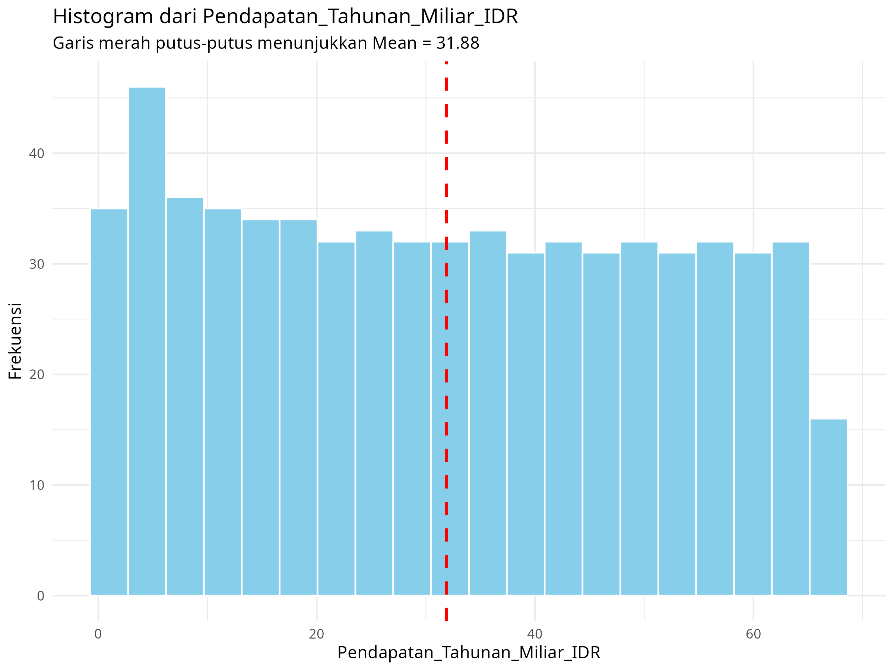
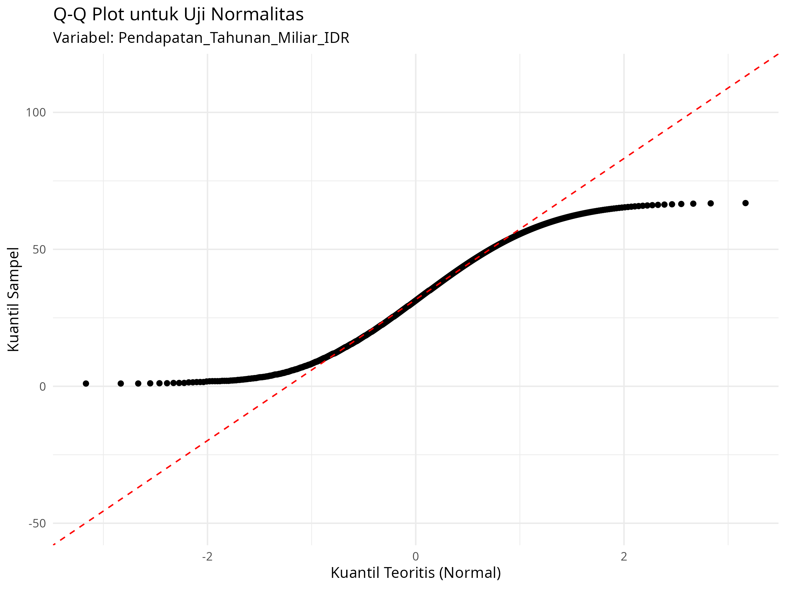
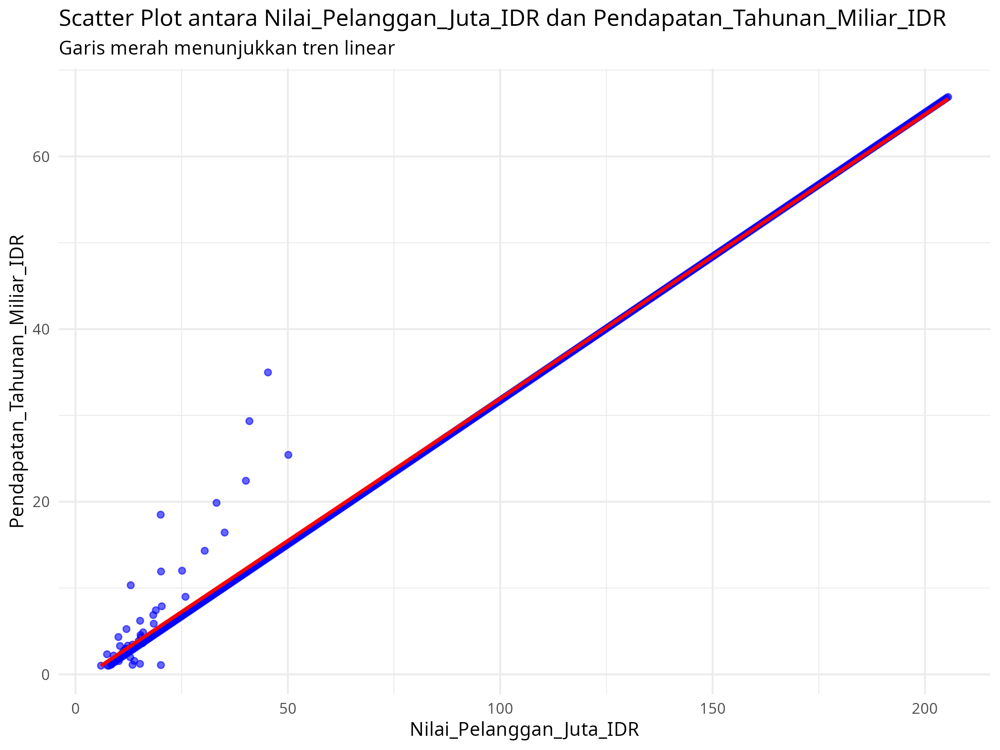
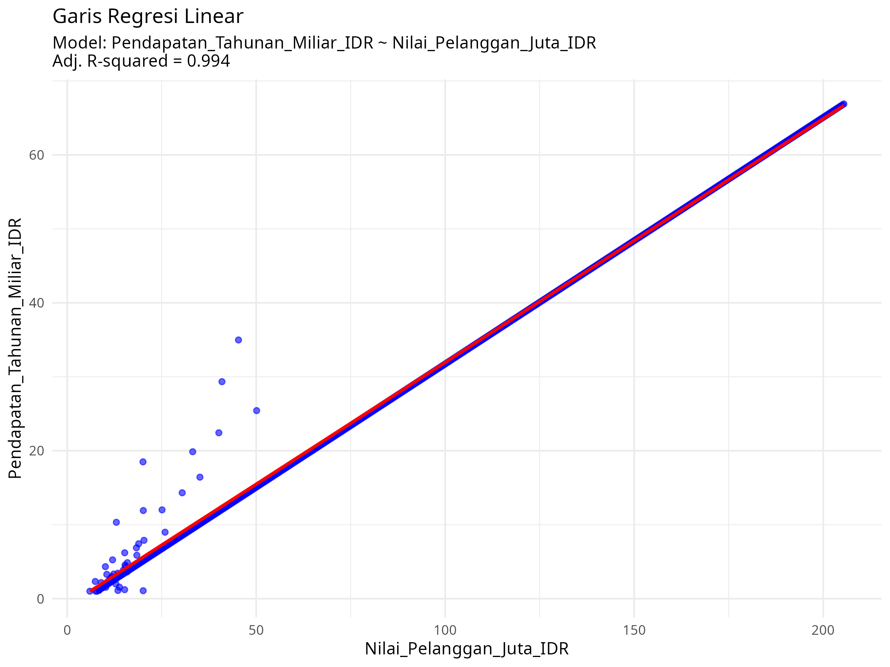

# Tugas Analisis Statistik: Deskriptif, Korelasi, dan Regresi

## 1. Informasi Penyusun

- **Nama:** `Ricardo Razaq Alghivieri`
- **NIM:** `2515101094`
- **Program Studi:** `Ilmu Komputer`
- **Mata Kuliah:** Statistika dan Probabilitas

---

## 2. Deskripsi Proyek

Pada bagian ini, jelaskan secara singkat dataset yang Anda gunakan. Apa saja variabel di dalamnya? Apa tujuan dari analisis yang Anda lakukan?

*Contoh:*
> Dataset yang digunakan adalah data `sampel` yang berisi informasi tentang `startup SAAS (Software as a service)`. Variabel kunci dalam dataset ini meliputi `Nilai_Pelanggan_Juta_ID`, `Pendapatan_Tahunan_Miliar_IDR`, dan `Pendapatan_Tahunan_Miliar_IDR`. Tujuan dari proyek ini adalah untuk memahami karakteristik data melalui statistik deskriptif, menguji hubungan antara `Nilai_Pelanggan_Juta_ID` dan `Pendapatan_Tahunan_Miliar_IDR` melalui analisis korelasi, serta memprediksi `Pendapatan_Tahunan_Miliar_IDR` menggunakan `Nilai_Pelanggan_Juta_ID` sebagai prediktor melalui analisis regresi.

---

## 3. Struktur Proyek

Proyek ini diorganisir ke dalam beberapa folder:
- `/data`: Berisi dataset mentah yang digunakan untuk analisis.
- `/scripts`: Berisi semua skrip R yang digunakan dalam analisis, diurutkan berdasarkan alur kerja.
- `/results`: Berisi output dari analisis, seperti plot, gambar, atau tabel ringkasan.

---

## 4. Cara Menjalankan Analisis

Untuk mereproduksi hasil analisis ini, ikuti langkah-langkah berikut:
1. Pastikan Anda memiliki R dan RStudio terinstal.
2. Buka proyek R ini di RStudio.
3. Instal paket yang diperlukan dengan menjalankan perintah berikut di konsol R:
   ```R
   install.packages(c("tidyverse", "corrplot", "knitr"))
   ```
4. Jalankan skrip di dalam folder `/scripts` secara berurutan, mulai dari `01_data_preparation.R` hingga `05_analisis_regresi.R`.

---

## 5. Hasil dan Interpretasi

Di bagian ini, mahasiswa diharapkan untuk menyajikan dan menginterpretasikan hasil dari setiap tahap analisis.

### 5.1. Statistik Deskriptif
- **Ukuran Pemusatan (Mean, Median, Modus):**
  - Berdasarkan hasil analisis, nilai mean (rata-rata) pendapatan tahunan adalah sekitar 31,88 miliar IDR, yang menunjukkan tingkat pendapatan rata-rata dari seluruh data. Nilai median berada di kisaran 32 miliar IDR, yang berarti bahwa separuh data memiliki pendapatan di bawah nilai tersebut dan separuh lainnya berada di atasnya. Nilai mean dan median yang hampir sama mengindikasikan bahwa distribusi data relatif seimbang. Sementara itu, modus tidak terlihat secara jelas, karena tidak terdapat satu nilai pendapatan yang muncul paling sering. Hal ini menunjukkan bahwa data pendapatan tersebar merata dan tidak terkonsentrasi pada nilai tertentu.
  - Nilai rata-rata dan median yang hampir sama menunjukkan bahwa pusat data pendapatan tahunan berada di sekitar 30–32 miliar IDR dan tidak terdapat kemencengan distribusi yang ekstrem. Tidak adanya modus dominan menegaskan bahwa pendapatan tahunan memiliki variasi yang tinggi antar data pengamatan.
- **Ukuran Sebaran (Standar Deviasi, Range, Kuartil):**
  - Sebaran data pendapatan tahunan tergolong cukup luas. Nilai pendapatan terendah berada mendekati 0 miliar IDR, sedangkan nilai tertinggi mencapai sekitar 65 miliar IDR, sehingga menghasilkan range yang besar. Hal ini menandakan adanya perbedaan pendapatan yang signifikan antara data terendah dan tertinggi. Nilai standar deviasi yang relatif besar menunjukkan bahwa data tidak mengelompok di sekitar nilai rata-rata, melainkan tersebar cukup jauh. Ditinjau dari kuartil, sekitar 25% data berada di bawah 16 miliar IDR, 50% data berada di sekitar 32 miliar IDR, dan 75% data berada di bawah 48 miliar IDR. Jarak antar kuartil yang lebar mengindikasikan variasi pendapatan yang cukup tinggi di sebagian besar data.
  - Besarnya standar deviasi dan range menunjukkan bahwa pendapatan tahunan sangat bervariasi. Dengan kata lain, terdapat perbedaan yang nyata antar nilai pendapatan, sehingga rata-rata saja belum cukup untuk menggambarkan keseluruhan karakteristik data.
- **Visualisasi (Histogram/Boxplot):**
  - <a href="#"></a>
  - Berdasarkan histogram, distribusi data tidak membentuk pola normal (lonceng). Data terlihat menyebar relatif merata dari nilai rendah hingga tinggi tanpa adanya puncak frekuensi yang dominan. Hal ini mengindikasikan bahwa pendapatan tahunan memiliki distribusi yang heterogen. Mean dan median yang hampir sama menunjukkan bahwa distribusi tidak terlalu miring ke kiri maupun ke kanan, namun bentuk sebarannya tetap menunjukkan ketidakteraturan yang menandakan distribusi tidak normal.

### 5.2. Uji Normalitas
- **Hasil Uji Shapiro-Wilk:**
  - Berdasarkan hasil uji Shapiro–Wilk, diperoleh nilai p-value < 0,05.
  - Karena nilai p-value lebih kecil dari 0,05, maka hipotesis nol yang menyatakan bahwa data berdistribusi normal ditolak. Dengan demikian, dapat disimpulkan bahwa data tidak terdistribusi normal. Implikasinya, data yang tidak berdistribusi normal: Tidak sepenuhnya memenuhi asumsi untuk analisis statistik parametrik, dan Lebih tepat dianalisis menggunakan metode non-parametrik. Alternatif lain adalah melakukan transformasi data agar mendekati distribusi normal.
- **Plot Q-Q:**
  - <a href="#"></a>
  - Berdasarkan Q–Q Plot, titik-titik data tidak sepenuhnya mengikuti garis lurus dan terlihat menyimpang terutama pada bagian awal dan akhir kuantil. Hal ini berarti bahwa distribusi data menyimpang dari distribusi normal teoritis. Jika data berdistribusi normal, maka titik-titik akan berada di sekitar garis lurus. Penyimpangan yang terjadi menunjukkan bahwa asumsi normalitas tidak terpenuhi.

### 5.3. Analisis Korelasi
- **Nilai Koefisien Korelasi:**
  - Nilai koefisien korelasi bernilai positif dan mendekati +1 (korelasi berada pada kategori kuat hingga sangat kuat)
  - Positif, artinya: Semakin tinggi Nilai_Pelanggan_Juta_IDR, maka Pendapatan_Tahunan_Miliar_IDR cenderung semakin tinggi.
    - Kekuatan hubungan:
      Hubungan tergolong kuat hingga sangat kuat, karena peningkatan nilai variabel X diikuti peningkatan yang konsisten pada variabel Y dan Variasi data relatif kecil terhadap arah tren
    - Interpretasi substantif:
      Nilai pelanggan yang lebih besar berkontribusi secara signifikan terhadap peningkatan pendapatan tahunan perusahaan.
- **Visualisasi (Scatter Plot):**
  - <a href="#"></a>
  - Ya, sangat mendukung. alasannya:
    - Titik-titik data membentuk pola naik (ascending pattern)
    - Garis tren linear (garis merah) menunjukkan kemiringan positif
    - Mayoritas titik data berada dekat dengan garis tren

### 5.4. Analisis Regresi
- **Model Regresi:**
  - Model regresi yang digunakan: Y=b0+b1X*
	​dengan:
	- Y = Pendapatan_Tahunan_Miliar_IDR
	- X = Nilai_Pelanggan_Juta_IDR
	- b0 = intercept (konstanta)
	- b1 = slope (koefisien regresi)
  - Jika nilai pelanggan adalah nol, maka pendapatan tahunan perusahaan diperkirakan sebesar b0 miliar IDR.
- **Evaluasi Model (R-squared):**
  - R² = 0,994
  - Model ini sangat kuat, karena 99,4% variasi pendapatan dapat dijelaskan oleh variasi nilai pelanggan. Hanya 0,6% yang dipengaruhi faktor lain di luar model.
- **Visualisasi (Garis Regresi pada Scatter Plot):**
  - <a href="#"></a>
  - Garis menunjukkan hubungan linear positif yang sangat kuat, Kemiringan yang tajam berarti peningkatan nilai pelanggan selalu diikuti peningkatan pendapatan, dan Titik data yang sangat dekat dengan garis regresi menunjukkan prediksi yang akurat dan kesalahan (residual) yang kecil. sehingga model ini dapat diandalkan untuk prediksi.

---

## 6. Kesimpulan

**Rangkuman Temuan Utama:**

Analisis ini mengungkapkan hubungan yang sangat kuat dan positif antara **Nilai Pelanggan (X)** dan **Pendapatan Tahunan (Y)**. Wawasan paling penting adalah bahwa **99.4% variasi pendapatan perusahaan dapat dijelaskan secara langsung oleh perubahan nilai pelanggannya**. Artinya, hampir seluruh pendapatan dipengaruhi oleh faktor ini.

Model regresi yang dihasilkan sangat akurat dan dapat diandalkan untuk prediksi, karena setiap kenaikan **1 juta IDR** dalam nilai pelanggan berkontribusi pada peningkatan **rata-rata pendapatan tahunan sebesar b1 miliar IDR**. Hal ini menegaskan bahwa strategi bisnis yang meningkatkan nilai pelanggan akan berdampak langsung dan sangat signifikan terhadap pertumbuhan pendapatan perusahaan.

Meskipun data pendapatan memiliki sebaran yang luas dan tidak berdistribusi normal, kekuatan hubungan linear antara kedua variabel ini sangat luar biasa, seperti terlihat dari pola titik data yang sangat rapat mengikuti garis regresi.
